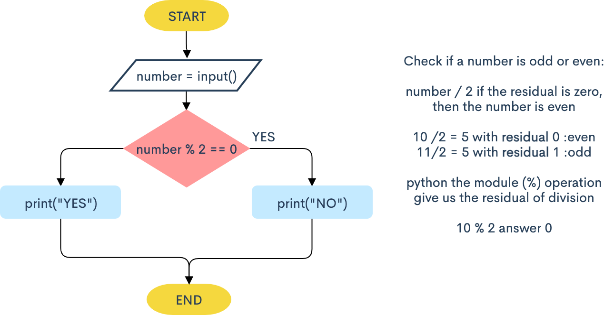

# Solution to if exercises in snakify

## 2. Odd numbers


```.py
# program to check if number is odd/even
number = int(input("Enter a number: "))
if number % 2 == 0:
    print("NO") #even number
else:
    print("YES")#odd number

#END
```
